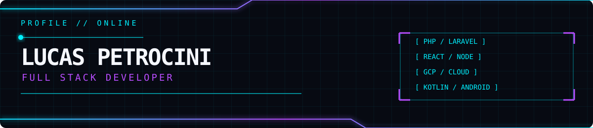

<div align="center">



<a href="https://www.linkedin.com/in/lucas-petrocini-57843321b"></a>
<a href="https://github.com/petrocini/portfolio"></a>

</div>

```text
STATUS: ONLINE
FOCO: produtos web · integrações · sistemas internos · automações
```

## // EXPERIÊNCIA

| AGORA | HISTÓRICO |
| --- | --- |
| **Spun Mídia** · PHP/Laravel, GAM, GCP, Python e JavaScript | **Codebit** · microsserviços, Cloud Run, Redis e BigQuery<br><br>**Usina Jussara** · sistemas de produção, RFID, offline-first e Kotlin |

## // STACK

<div align="center">


</div>

<div align="center">

<sub>São Paulo, Brasil · <a href="https://github.com/petrocini?tab=repositories">repositórios</a> · <a href="https://github.com/petrocini/portfolio">portfólio</a></sub>

</div>
